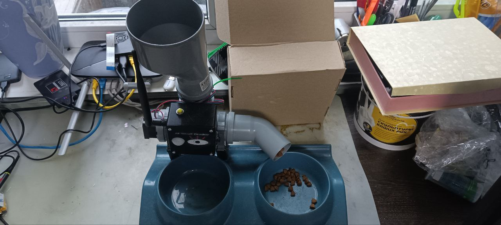

# Description
### **Smart Pet Feeder with Computer Vision**

This is an advanced project for a **smart pet feeder** that uses computer vision to autonomously manage feeding. The core of the system is built around an **ESP32-CAM microcontroller** and a separate server for processing video streams with a neural network.

### **Key Features**

- **Custom PCB**: A custom-designed PCB was developed for the ESP32-CAM microcontroller, enabling seamless integration of a camera and motion sensor.
- **YOLOv3 Integration**: A server-side application processes a live video stream from the ESP32 using the **YOLOv3 neural network** to detect and identify pets.
- **Dual Communication Protocols**: The system supports two communication methods for flexibility:
  - **ROS2 & micro-ROS**: A robust and scalable communication framework for a more complex robotic ecosystem.
  - **MQTT**: An alternative protocol for simpler, independent use without relying on the ROS2 server.
- **Modular Design**: The project features a custom-modeled and 3D-printed enclosure for the microcontroller, camera, and motion sensor. The video processing server is separate from the feeder, allowing for greater flexibility and easier hardware upgrades.

### **How It Works**

1.  When the motion sensor is triggered, the ESP32 sends a message to the main ROS2 node.
2.  The ESP32 then begins streaming video in **MJPEG format**.
3.  A ROS2 node on a Raspberry Pi reads and processes the video stream.
4.  The YOLOv3 neural network is used to detect cats in the images. The image is also binarized to identify a specific pet, which is a key requirement of my project.
5.  If a cat is detected and has not been fed in the last two hours, a message is sent to the ESP32 to activate the stepper motor for a predefined number of steps, dispensing food.
6.  Manual feeding is also possible via a button on the feeder's body.
7.  A built-in LED on the ESP32-CAM module provides illumination, allowing the system to operate effectively at night.


Demo Video on youtube

[](https://youtube.com/shorts/kwAZKxZ1nS4)

---

## How to setup
To run microRos agent

```bash
docker run -it --rm -v /dev:/dev --privileged --net=host microros/micro-ros-agent:jazzy udp4 --port 8888
```

send message to feed

```
ros2 topic pub /SmartFeederInput --once std_msgs/msg/Int32 "{data: -1}"
```

to change portion size

```
ros2 topic pub /SmartFeederInput --once std_msgs/msg/Int32 "{data: 200}"
```

where 200 - number of steps for stepper motor

### TODO

- write your network settings into ESP_code/SmartFeeder/src/main.cpp
- download files for yolov3: [yolov3.weights](https://pjreddie.com/media/files/yolov3.weights), [yolov3.cfg](https://github.com/pjreddie/darknet/blob/master/cfg/yolov3.cfg?raw=true), [coco.names](https://github.com/pjreddie/darknet/blob/master/data/coco.names?raw=true)
    to download you can use wget:
    ```bash
    wget https://pjreddie.com/media/files/yolov3.weights
    wget https://github.com/pjreddie/darknet/blob/master/cfg/yolov3.cfg?raw=true
    wget https://github.com/pjreddie/darknet/blob/master/data/coco.names?raw=true
    ```
- provide path to files for the VideReaderPublisher node
